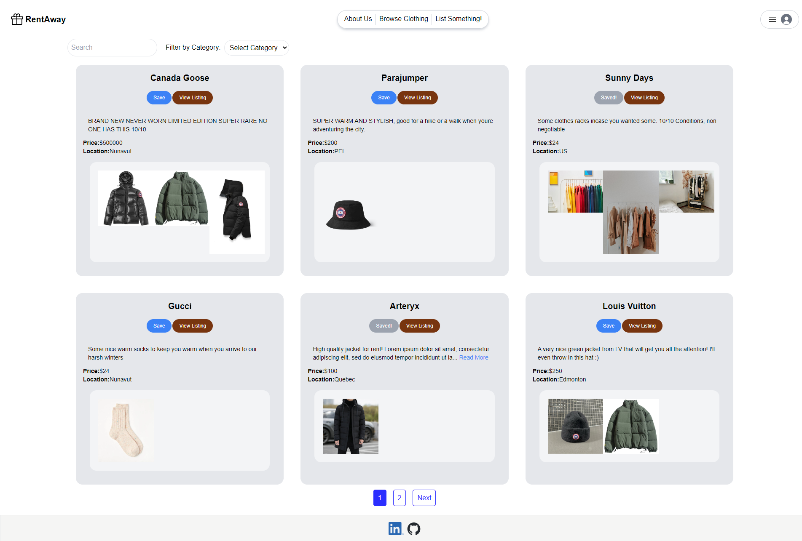

<a name="readme-top"></a>
<br />

 <div align="center">
 <h1 align="center">RentAway</h1>

<a href="https://github.com/cntrieu/rentaway">


</a>

<br />
<details><summary>Table of Contents;</summary>

- [About the Project](#description)

- [Added Features](#features)

- [Installation](#installation)

- [Usage](#usage)

- [Contributing](#contributing)

- [License](#license)

- [Questions](#questions)

</details>
</div>

<p align="right">(<a href="#readme-top">back to top</a>)</p>

<a name="description"></a>

## :rocket: About The Project


<h3 align="center"> Introducing RentAway: </h3>

RentAway is an innovative e-commerce project developed with the powerful MERN stack, consisting of MongoDB, Express.js, React, and Node.js. This platform empowers individuals by allowing them to sign up and share their clothing items for rent with other users. RentAway employs JWT (JSON Web Tokens) and bcrypt to safeguard user information. Additionally, it utilizes Cloudinary for seamless image hosting and offers comprehensive CRUD (Create, Read, Update, Delete) functionality for managing listings and account information. For a more detailed explanation of RentAway's features and functionalities, please refer to the subsequent sections of the README.

Website: <a href="https://rentaway.onrender.com/">RentAway</a>


## :star: Added Features

- Login/Register, with ability to update information or delete account and all contents
- Post items with descriptions and photos with options to delete and update listing
- Ability for users to write reviews on products
- Save different products to view them later
- Users can search all listings using keywords or filter clothes by category
- IN PROGRESS: Messaging other users within platform

<p align="right">(<a href="#readme-top">back to top</a>)</p>

<a name="installation"></a>

## :hammer_and_wrench: Installation

1. Clone the repository

```bash
git clone https://github.com/cntrieu/rentaway
```

2. Change the Working Directory

```bash
cd rentaway
```


3. Install [`react`](https://www.npmjs.com/package/react), [`bcrypt`](https://www.npmjs.com/package/bcrypt), [`express`](https://www.npmjs.com/package/console.table), [`jsonwebtoken`](https://www.npmjs.com/package/jsonwebtoken), [`mongoose`](https://www.npmjs.com/package/mongoose), [`dotenv`](https://www.npmjs.com/package/dotenv), and [`cors`](https://www.npmjs.com/package/cors)


```bash
npm install
```


<p align="right">(<a href="#readme-top">back to top</a>)</p>

<a name="usage"></a>

## :computer: Usage

<div align="center">
  <h2><a href="https://rentaway.onrender.com/" target="_blank">🌐 Deployed Website</a></h2>
  <p>Click the link above to explore our live application!</p>
  <a href="https://rentaway.onrender.com/" target="_blank">
    
     
      
      
       
  </a>
</div>
 <br />
  <br />
<p align="right">(<a href="#readme-top">back to top</a>)</p>


<a name="contributing"></a>

## :handshake: Contributing

I welcome any contributions to this project. Feel free to reach out to me on LinkedIn or GitHub!

### Calvin Trieu

<div align="center">
    <a href="https://www.linkedin.com/in/calvin-trieu/" target="_blank">LinkedIn</a> | 
    <a href="https://github.com/cntrieu" target="_blank">GitHub</a>
</div>

---


<p align="right">(<a href="#readme-top">back to top</a>)</p>

<a name="license"></a>

## :clipboard: License

MIT

<p align="right">(<a href="#readme-top">back to top</a>)</p>


<a name="questions"></a>

## :mailbox_with_no_mail: Questions?

If you have any questions about this project, please don't hesitate to reach out to me. I'm always happy to help and provide additional information.

### How to Ask a Question

1. **Check the existing documentation:** Before asking a question, please take a moment to review the existing documentation. Your question may already be answered in the README file or other project documentation.

2. **Create a new issue:** If you can't find the answer to your question in the documentation, please create a new issue in the project's issue tracker. Be sure to provide as much detail as possible about your question, including any relevant code snippets or screenshots.


### :pray: Feedback and Suggestions

I welcome feedback and suggestions for this project. If you have ideas for how to improve the project, please feel free to create a new issue or contact me directly. Your input is greatly appreciated!

  <p align="right">(<a href="#readme-top">back to top</a>)</p>